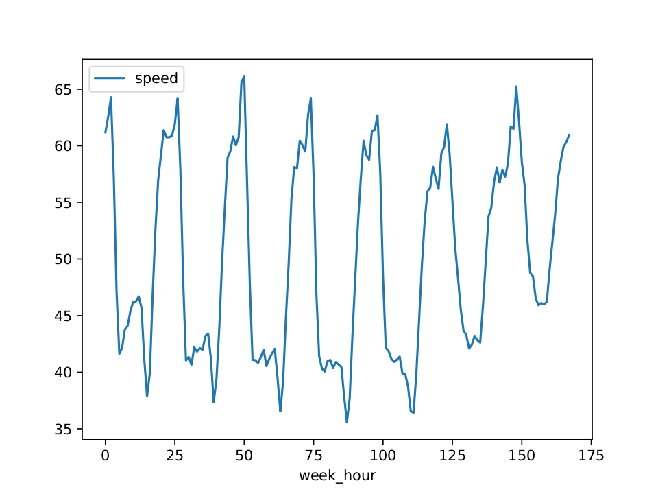

## Библиотека compgraph
Реализует базовый функционал графов вычислений.
Графы могут работать как с файлами, так и с iterable объектами.

### Модули

##### Модуль [graph](graph.py)
Содержит класс `Graph`, реализующий граф вычислений\
Есть два основных способа создания вычислительного графа:

```python
import ast
from compgraph.graph import Graph

# Создание графа из iterable (сам объект передается в run)
Graph.graph_from_iter("name_of_kwargs_key")
# Создание графа из файла (передается имя файла и парсер, конвертирующий строку файла в TRow
# Во всех внутренних реализациях используется ast.literal_eval
Graph.graph_from_file('filename', parser=ast.literal_eval)
```
После создания графа к нему могут быть применены различные операции и выполнен запуск

```python
import ast
from compgraph.graph import Graph

graph1 = Graph.graph_from_iter("name_of_kwargs_key")\
              .map(...)\
              .reduce(...)
graph2 = Graph.graph_from_file('filename', parser=ast.literal_eval) \
              .join(...) \
              .sort(...)

result1 = graph1.run(name_of_kwargs_key=iter(iterable_object))
result2 = graph2.run()

```
##### Модуль [operations](operations.py) 
Содержит основные операции (`Map`, `Reduce`, `Join`), а также различные сценарии их поведения.
```python
import compgraph.operations as ops 
from compgraph.graph import Graph

graph1 = Graph.graph_from_iter("name_of_kwargs_key")\
              .map(ops.DummyMapper())\
              .reduce(ops.TopN('some_column'))

```


##### Модуль [algorithms](algorithms.py)
Содержит функции, которые решают следующие задачи:
1) Word Count
2) TF-IDF
3) PMI
4) Yandex maps

Функции также поддерживают работу с файлами и iterable объектами. \
За режим работы отвечает параметр `filemod`:\
`True` - работа с файлом \
`False` - работа с объектом


### Установка библиотеки
Чтобы установить библиотеку запустите
`pip install -e compgraph --force-reinstall`
из директории tasks

### Запуск примеров из консоли 
Задачи можно запустить из консоли. Для парсинга аргументов командной строки использовался `click`. \
Пример запуска скриптов (из папки `tasks\compgraph`):\
1) Yandex maps
```
python3 examples/run_yandex_maps.py --input-time "resources/travel_times.txt" --input-length "resources/road_graph_data.txt" --output "result.txt"
```
2) PMI
```
python3 examples/run_pmi.py --input "resources/text_corpus.txt" --output "result.txt"
```
3) TF_IDF
```
python3 examples/run_inverted_index.py --input "resources/text_corpus.txt" --output "result.txt"
```
4) Word Count
```
python3 examples/run_word_count.py --input "resources/text_corpus.txt" --output "result.txt"
```
Примеры используют файлы из архива, в репозитории. Результат записывается в файл `result.txt`

### График средней скорости
В результате выполнения функции `yandex_maps_graph`, можно получить график средней скорости от времени.
По оси y - средняя скорость, по оси x - номер часа в неделе (к примеру Monday 19:00 это 24 * 0 + 19 = 19)


